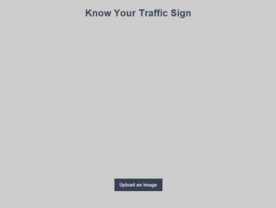

# Signopedia
## Table of Content
  - [Demo](#demo)
  - [Overview](#overview)
  - [Motivation/Purpose](#motivationpurpose)
  - [Technical Aspect](#technical-aspect)
  - [Data collection](#data-collection)
  - [Installation](#installation) 
  - [Run](#run)

## Demo
<br>
<br>


<br>
<div display="flex" >

 [![forthebadge](data:image/svg+xml;base64,PHN2ZyB4bWxucz0iaHR0cDovL3d3dy53My5vcmcvMjAwMC9zdmciIHdpZHRoPSIyMTQuODEiIGhlaWdodD0iMzUiIHZpZXdCb3g9IjAgMCAyMTQuODEgMzUiPjxyZWN0IGNsYXNzPSJzdmdfX3JlY3QiIHg9IjAiIHk9IjAiIHdpZHRoPSIxMTUuMzEiIGhlaWdodD0iMzUiIGZpbGw9IiNFNDZDMTciLz48cmVjdCBjbGFzcz0ic3ZnX19yZWN0IiB4PSIxMTMuMzEiIHk9IjAiIHdpZHRoPSIxMDEuNTAwMDAwMDAwMDAwMDEiIGhlaWdodD0iMzUiIGZpbGw9IiMwRDlCQTgiLz48cGF0aCBjbGFzcz0ic3ZnX190ZXh0IiBkPSJNMTUuNjkgMjJMMTQuMjIgMjJMMTQuMjIgMTMuNDdMMTYuMTQgMTMuNDdMMTguNjAgMjAuMDFMMjEuMDYgMTMuNDdMMjIuOTcgMTMuNDdMMjIuOTcgMjJMMjEuNDkgMjJMMjEuNDkgMTkuMTlMMjEuNjQgMTUuNDNMMTkuMTIgMjJMMTguMDYgMjJMMTUuNTUgMTUuNDNMMTUuNjkgMTkuMTlMMTUuNjkgMjJaTTI4LjQ5IDIyTDI2Ljk1IDIyTDMwLjE3IDEzLjQ3TDMxLjUwIDEzLjQ3TDM0LjczIDIyTDMzLjE4IDIyTDMyLjQ5IDIwLjAxTDI5LjE4IDIwLjAxTDI4LjQ5IDIyWk0zMC44MyAxNS4yOEwyOS42MCAxOC44MkwzMi4wNyAxOC44MkwzMC44MyAxNS4yOFpNNDEuMTQgMjJMMzguNjkgMjJMMzguNjkgMTMuNDdMNDEuMjEgMTMuNDdRNDIuMzQgMTMuNDcgNDMuMjEgMTMuOTdRNDQuMDkgMTQuNDggNDQuNTcgMTUuNDBRNDUuMDUgMTYuMzMgNDUuMDUgMTcuNTJMNDUuMDUgMTcuNTJMNDUuMDUgMTcuOTVRNDUuMDUgMTkuMTYgNDQuNTcgMjAuMDhRNDQuMDggMjEuMDAgNDMuMTkgMjEuNTBRNDIuMzAgMjIgNDEuMTQgMjJMNDEuMTQgMjJaTTQwLjE3IDE0LjY2TDQwLjE3IDIwLjgyTDQxLjE0IDIwLjgyUTQyLjMwIDIwLjgyIDQyLjkzIDIwLjA5UTQzLjU1IDE5LjM2IDQzLjU2IDE3Ljk5TDQzLjU2IDE3Ljk5TDQzLjU2IDE3LjUyUTQzLjU2IDE2LjEzIDQyLjk2IDE1LjQwUTQyLjM1IDE0LjY2IDQxLjIxIDE0LjY2TDQxLjIxIDE0LjY2TDQwLjE3IDE0LjY2Wk01NS4wOSAyMkw0OS41MSAyMkw0OS41MSAxMy40N0w1NS4wNSAxMy40N0w1NS4wNSAxNC42Nkw1MS4wMCAxNC42Nkw1MS4wMCAxNy4wMkw1NC41MCAxNy4wMkw1NC41MCAxOC4xOUw1MS4wMCAxOC4xOUw1MS4wMCAyMC44Mkw1NS4wOSAyMC44Mkw1NS4wOSAyMlpNNjYuNjUgMjJMNjQuNjggMTMuNDdMNjYuMTUgMTMuNDdMNjcuNDcgMTkuODhMNjkuMTAgMTMuNDdMNzAuMzQgMTMuNDdMNzEuOTYgMTkuODlMNzMuMjcgMTMuNDdMNzQuNzQgMTMuNDdMNzIuNzcgMjJMNzEuMzUgMjJMNjkuNzMgMTUuNzdMNjguMDcgMjJMNjYuNjUgMjJaTTgwLjM4IDIyTDc4LjkwIDIyTDc4LjkwIDEzLjQ3TDgwLjM4IDEzLjQ3TDgwLjM4IDIyWk04Ni44NyAxNC42Nkw4NC4yMyAxNC42Nkw4NC4yMyAxMy40N0w5MS4wMCAxMy40N0w5MS4wMCAxNC42Nkw4OC4zNCAxNC42Nkw4OC4zNCAyMkw4Ni44NyAyMkw4Ni44NyAxNC42NlpNOTYuMjQgMjJMOTQuNzUgMjJMOTQuNzUgMTMuNDdMOTYuMjQgMTMuNDdMOTYuMjQgMTcuMDJMMTAwLjA1IDE3LjAyTDEwMC4wNSAxMy40N0wxMDEuNTMgMTMuNDdMMTAxLjUzIDIyTDEwMC4wNSAyMkwxMDAuMDUgMTguMjFMOTYuMjQgMTguMjFMOTYuMjQgMjJaIiBmaWxsPSIjRkZGRkZGIi8+PHBhdGggY2xhc3M9InN2Z19fdGV4dCIgZD0iTTEyOS4yOSAxNS40OEwxMjYuNzEgMTUuNDhMMTI2LjcxIDEzLjYwTDEzNC4yMyAxMy42MEwxMzQuMjMgMTUuNDhMMTMxLjY2IDE1LjQ4TDEzMS42NiAyMkwxMjkuMjkgMjJMMTI5LjI5IDE1LjQ4Wk0xNDAuOTYgMjJMMTM4LjYwIDIyTDEzOC42MCAxMy42MEwxNDAuOTYgMTMuNjBMMTQwLjk2IDE3LjA5TDE0NC4yMSAxMy42MEwxNDYuODIgMTMuNjBMMTQzLjM5IDE3LjMyTDE0Ny4wMCAyMkwxNDQuMjQgMjJMMTQxLjg0IDE4Ljk1TDE0MC45NiAxOS45MEwxNDAuOTYgMjJaTTE1My40OSAyMkwxNTEuMTEgMjJMMTUxLjExIDEzLjYwTDE1My40OSAxMy42MEwxNTMuNDkgMjJaTTE2MS4wMCAyMkwxNTguNjYgMjJMMTU4LjY2IDEzLjYwTDE2MC42MiAxMy42MEwxNjQuMzMgMTguMDdMMTY0LjMzIDEzLjYwTDE2Ni42NiAxMy42MEwxNjYuNjYgMjJMMTY0LjcwIDIyTDE2MS4wMCAxNy41MkwxNjEuMDAgMjJaTTE3My42MSAxNS40OEwxNzEuMDMgMTUuNDhMMTcxLjAzIDEzLjYwTDE3OC41NSAxMy42MEwxNzguNTUgMTUuNDhMMTc1Ljk4IDE1LjQ4TDE3NS45OCAyMkwxNzMuNjEgMjJMMTczLjYxIDE1LjQ4Wk0xODkuNjcgMjJMMTgyLjkyIDIyTDE4Mi45MiAxMy42MEwxODkuNTEgMTMuNjBMMTg5LjUxIDE1LjQ0TDE4NS4yOCAxNS40NEwxODUuMjggMTYuODVMMTg5LjAxIDE2Ljg1TDE4OS4wMSAxOC42M0wxODUuMjggMTguNjNMMTg1LjI4IDIwLjE3TDE4OS42NyAyMC4xN0wxODkuNjcgMjJaTTE5Ni44NSAyMkwxOTQuNDcgMjJMMTk0LjQ3IDEzLjYwTDE5OC4zMSAxMy42MFExOTkuNDYgMTMuNjAgMjAwLjI5IDEzLjk4UTIwMS4xMyAxNC4zNSAyMDEuNTkgMTUuMDZRMjAyLjA1IDE1Ljc2IDIwMi4wNSAxNi43MUwyMDIuMDUgMTYuNzFRMjAyLjA1IDE3LjYyIDIwMS42MiAxOC4zMFEyMDEuMTkgMTguOTggMjAwLjQwIDE5LjM2TDIwMC40MCAxOS4zNkwyMDIuMjEgMjJMMTk5LjY3IDIyTDE5OC4xNCAxOS43N0wxOTYuODUgMTkuNzdMMTk2Ljg1IDIyWk0xOTYuODUgMTUuNDdMMTk2Ljg1IDE3LjkzTDE5OC4xNyAxNy45M1ExOTguOTAgMTcuOTMgMTk5LjI3IDE3LjYxUTE5OS42NCAxNy4yOSAxOTkuNjQgMTYuNzFMMTk5LjY0IDE2LjcxUTE5OS42NCAxNi4xMiAxOTkuMjcgMTUuNzlRMTk4LjkwIDE1LjQ3IDE5OC4xNyAxNS40N0wxOTguMTcgMTUuNDdMMTk2Ljg1IDE1LjQ3WiIgZmlsbD0iI0ZGRkZGRiIgeD0iMTI2LjMxIi8+PC9zdmc+)](https://forthebadge.com)

</div>


## Overview
* **Simple Tkinter app fitted with Deep Convolutional neural network model which is able to distinguish between 43 different types of Traffic signs used worldwide with high accuracy.**<br><br>
* **Data to train this DNN is collected in (`/processed data`) folder, the images are taken from GTSRB - <u><b>German Traffic Sign Recognition Benchmark</b></u> which is a public dataset on Kaggle.**

<br>

## Motivation/Purpose
After completing the Deep learning specialization course. I was super excited to implement the knowledge I gained in practical and productional way by doing an **end to end project** with following purposes.
1. This application/technique can be applied to **motion planning** to make self driving cars.<br>  
2.  Want to give enlightenment to beginners in learning Tkinter as well as to train DNN and hypertune it to get better performance !<br>
3. Want to make more advancement in this project to serve people on the road and help them recognize different signs of which they are not aware about.

## Technical Aspect
#### This project is divided into Four major parts:
1. Organising the images in a clear way and removing low-quality images and outliers from the dataset.
2. Training the model on the images and setting up a benchmark model to improve upon.
3. Fine Tuning the model by improving the architecture and doing hyperparameter search.
4. Building a Tkinter GUI.
   
## Data collection
As we know *data* is building block of Data science!<br>
I had collected the images from a public dataset on Kaggle. You can download it for your project from 
(`/processed data`) folder.<br>
<div class="row">
  <div class="col">
     
  </div>
</div>

<br>

## Installation
The Code is written in Python 3.8 in an anaconda environment. For anaconda instalation click <a href="https://www.anaconda.com/products/individual">here</a>.To make new environment in anaconda run following commands in your **Anaconda Prompt**.
```
conda create -n your_env_name python=3.8.x
```

## Run
After successfully creating anaconda environment, install the required packages and libraries by running this command in the project directory after cloning the repository:
```
pip install -r requirements.txt
```
then by running the following command, it will open a dialog box  containing the GUI for using the application.
```
python gui.py
```

## Technologies Used


<br><br><br>

<br><br><br>


