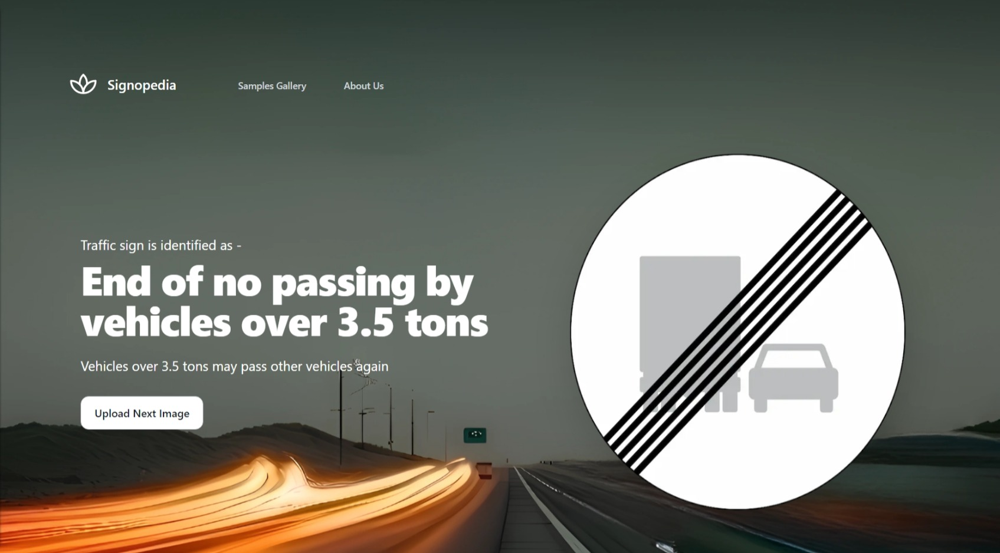

# Signopedia

## Links to access the app

* http://ec2-43-204-47-110.ap-south-1.compute.amazonaws.com/
* http://43.204.47.110/

 

## Table of Content
- [Signopedia](#signopedia)
  - [Links to access the app](#links-to-access-the-app)
  - [Table of Content](#table-of-content)
  - [Demo](#demo)
  - [Samples Gallery](#samples-gallery)
  - [Overview](#overview)
  - [Motivation/Purpose](#motivationpurpose)
  - [Technical Aspect](#technical-aspect)
      - [This project is divided into Four major parts](#this-project-is-divided-into-four-major-parts)
  - [Data collection](#data-collection)
  - [Run](#run)
  - [Technologies Used](#technologies-used)

## Demo

 
 

 
 

 
 

 

 

## Samples Gallery

* You can also try some of our own images
  
 

## Overview

* **Simple Web app fitted with Deep Convolutional neural network model which is able to distinguish between 43 different types of Traffic signs used worldwide with high accuracy.**  
- **Data to train this DNN is collected in (`/processed data`) folder, the images are taken from GTSRB - <u><b>German Traffic Sign Recognition Benchmark</b></u> which is a public dataset on Kaggle.**

 

## Motivation/Purpose

After completing the Deep learning specialization course. I was super excited to implement the knowledge I gained in practical and productional way by doing an **end to end project** with following purposes.

1. This application/technique can be applied to **motion planning** to make self driving cars.   
2. Want to give enlightenment to beginners in learning Tkinter as well as to train DNN and hypertune it to get better performance ! 
3. Want to make more advancement in this project to serve people on the road and help them recognize different signs of which they are not aware about.

## Technical Aspect

#### This project is divided into Four major parts

1. Organising the images in a clear way and removing low-quality images and outliers from the dataset.
2. Training the model on the images and setting up a benchmark model to improve upon.
3. Fine Tuning the model by improving the architecture and doing hyperparameter search.
4. Building a Web application with the help of NextJS and Django.
5. Deployed the Website on AWS EC2 with the help on Nginx,  Docker and Kuberbetes
   
## Data collection

As we know *data* is building block of Data science! 
I had collected the images from a public dataset on Kaggle. You can download it for your project from
(`/processed data`) folder. 

  

     
  

 

## Run

Go to the following URL to try out our app:

* http://ec2-43-204-47-110.ap-south-1.compute.amazonaws.com/
* http://43.204.47.110/

## Technologies Used

